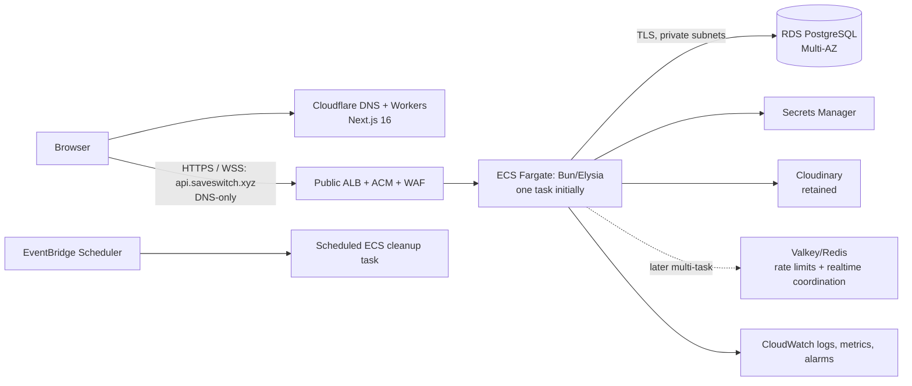

# Saveswitch: Heroku and Neon to AWS migration plan

**Status (2026-09-20):** the owner accepted a mutually exclusive, low-cost
Lightsail redesign. Its repository implementation is offline-only and uses the
proposed state key `lightsail-production/core.tfstate`. No Lightsail resource,
Terraform state, Cloudflare Tunnel, production database, secret, or deployment
has been created by this redesign.

**Audience:** the Saveswitch owner and the engineer(s) performing the migration.

**Original decision date / external-source access date:** 2026-09-18.

**Superseding architecture decision date:** 2026-09-20.

## Executive decision

The active AWS target is one public-IPv4 AWS Lightsail Linux instance in
`us-east-1`, hosting the Bun/Elysia API and PostgreSQL on the same machine.
PostgreSQL data uses a separately attached Lightsail disk. The API binds only
to loopback and is published through an outbound-only Cloudflare Tunnel;
Cloudflare retains frontend, DNS, public TLS, and edge-policy ownership.
Cloudinary remains the media/object-storage provider.

This deliberately low-cost design accepts one instance and one Availability
Zone, shared API/database capacity, maintenance downtime, and recovery from
tested logical backups and snapshots. The provisional objectives are
approximately 24-hour RPO and four-hour RTO, subject to a successful isolated
restore drill. An account-wide USD 25 AWS Budget provides alerts only; it is
not a guaranteed billing cap.

Terraform source for this target lives in
`infra/aws/lightsail-production/`, with proposed remote state key
`lightsail-production/core.tfstate`. It is mutually exclusive with the older
`infra/aws/production/` root. The latter has never been applied and must not be
initialized, planned, or applied. Existing `bootstrap/shared.tfstate` and
`certificate/production.tfstate` remain separate; the issued ACM certificate
is retained but unused by Cloudflare Tunnel.

### Superseded 2026-09-18 ECS/RDS decision (historical only)

Move the current dynamic Next.js frontend to **Cloudflare Workers** and use
**Cloudflare DNS**. Move the Bun/Elysia API to a container image in **Amazon
ECR**, served by an **ECS Fargate** service behind an internet-facing
**Application Load Balancer (ALB)**. Use private **Amazon RDS for PostgreSQL**
with a Multi-AZ DB instance as the recommended production baseline. Keep the
initial ECS service at **one task** until a shared Valkey/Redis coordination
layer and an external scheduled-cleanup task are implemented. Use AWS Secrets
Manager, CloudWatch, ACM, AWS WAF, and infrastructure as code (IaC).

Initially, Cloudflare hosts the frontend and owns DNS, while
`api.saveswitch.xyz` is a **DNS-only** record to the public ALB. Browser HTTPS
and WSS traffic reaches the ALB directly; ACM terminates API TLS and AWS WAF
protects that ALB. Cloudflare proxying of the API is a separate later decision,
not part of this migration.

This is a deliberate lift-and-improve plan, not a Lambda/API Gateway rewrite.
It preserves the public API hostname `api.saveswitch.xyz`, the production JWT
signing secret, the Google OAuth callback contract, and the frontend-origin
contract through cutover.

### Historical ECS/RDS decisions (superseded)

| Area | Decision | Why / condition |
|---|---|---|
| AWS Region | `us-east-1` | Owner-selected target Region; current service support, quotas, and pricing still require validation before deployment. |
| Frontend | Cloudflare Workers for the present dynamic Next.js 16 application | It requires dynamic Next.js support; static Pages would require a redesign. Cloudflare's current Next.js guidance should be rechecked during implementation because its recommended adapter can change. |
| API | ECS Fargate + ALB + ECR; DNS-only `api.saveswitch.xyz` record to ALB | Fits the existing long-lived Bun/Elysia HTTP and WebSocket process. ALB supports WebSocket upgrades; browser API traffic is direct to ALB initially. |
| Database | RDS for PostgreSQL, private, Multi-AZ DB instance baseline | Provides managed PostgreSQL and a synchronous standby in another AZ. It is high availability, not read scaling. |
| Merge | Restore sources separately, transform/audit, then load a clean RDS target; Heroku wins compatible conflicts and Neon is additive | Prevents accidental source-to-source overwrites and leaves an auditable merge record. The owner approved Heroku precedence. |
| Initial scale | One API task | The code currently keeps rate-limit, WebSocket topic, and periodic work state in process. |
| Later scale | Valkey/Redis plus EventBridge Scheduler before multiple API tasks | Shared coordination and external scheduled work are prerequisites to safe horizontal scale. |
| Media | Retain Cloudinary; do not move media to S3 in this migration | Current production code relies on Cloudinary credentials and stores provider identifiers. |
| Rejected / deferred | App Runner, Lambda/API Gateway rewrite, Aurora, static Cloudflare Pages | App Runner is closed to new customers after 2026-03-31; the rewrite and Aurora lack an evidenced need; Pages is incompatible with the current dynamic frontend without redesign. |

App Runner's availability status must be confirmed against AWS's current
service availability reference before any exception is considered. Do not
replace this decision with a similarly named AWS service without a new review.

## Verified current state

### Read-only platform inventory

The following inventory was obtained without reading Heroku logs, because logs
can contain user data or secrets. Account identities, IDs, email addresses,
and unrelated Cloudflare zones are intentionally omitted.

| Surface | Verified state | Migration implication |
|---|---|---|
| Heroku API | `saveswitch-api` is active with one Basic web dyno and Heroku Postgres Essential-0 | Treat this as a production database source and capture a protected logical export. |
| Heroku web | `saveswitch-web` is active with one Basic web dyno | It remains an immediately available rollback frontend until retirement. |
| Heroku client | `saveswitch-client` has no dynos or add-ons | Do not treat it as an active source or migration target without owner confirmation. |
| Neon | A previously used database exists and is intended to be merged | It is a separate source, not an assumed replica of Heroku. Validate access, schema, and provenance before export. |
| Cloudflare | No Pages projects and no Worker scripts currently exist | Cloudflare frontend hosting is greenfield. |
| Repo frontend | `client/package.json` declares Next.js 16.3.3; client calls the API using build-time `NEXT_PUBLIC_API_BASE`/`NEXT_PUBLIC_API_URL` | Build a dynamic Workers deployment; set the public API hostname at build/deploy time. |
| Repo API | Bun/Elysia binds `PORT`, offers `/health`, requires `DATABASE_URL` outside development, performs Google OAuth and exposes WebSocket `/ws` | Run one resource-bounded, non-root container on the Lightsail host, bound only to loopback for Cloudflare Tunnel; complete the production-readiness gates below. |
| Repo database | Drizzle schema defines `users`, `pages`, `resources`, and `asset_deletion_queue` | Canonical target schema must be established before data is merged. |

### Database rehearsal completed on 2026-09-19

Protected PostgreSQL 18 logical dumps of both sources were restored into
separate disposable databases and attached read-only to a third clean canonical
rehearsal database. Exact source-to-stage table counts matched. Heroku contained
2 users, 23 pages, 182 resources, and an empty deletion queue; Neon contained 3
users, 16 pages, and 196 resources. The only overlap was one shared user ID with
divergent profile attributes, resolved by the approved Heroku-precedence rule.

The clean rehearsal produced 4 users, 39 pages, 378 resources, and an empty
deletion queue. Its FDW path now uses dedicated staging roles with remote
read-only defaults and SELECT-only grants; a negative test proved both roles
reject DML, and the guard rejects a table-level write override. Aggregate and
field-level validation found no unresolved conflicts, unique-key collisions,
foreign-key orphans, invalid modeled values, negative sizes or counters,
queued Cloudinary references, count-reconciliation mismatches, or field
mapping mismatches. A protected canonical custom-format dump restored cleanly
to a separate empty database with all expected counts, validated constraints,
and valid indexes. No records in the captured snapshots were already expired,
so expiry preservation remains structurally but not empirically exercised; the
merge contains no expiry filter and will preserve such records.

### Correct stale repository documentation before relying on it

`architecture.md` describes a Vite/React Router/Socket.IO frontend, Neon as the
database, and a cron approach. Those descriptions no longer match the checked
in application: the frontend is Next.js 16, the API uses native Elysia/Bun
WebSockets, and the API currently runs cleanup from an in-process interval.
`HEROKU_DEPLOYMENT.md` remains useful as a legacy deployment record but is not
the AWS target design. This plan is the migration decision record. The
Lightsail IaC redesign has landed with offline evidence; live AWS, host,
PostgreSQL, container, backup/restore, and Cloudflare acceptance remain
separately gated.

### Source-code facts that shape the design

- `server/src/runtime-config.ts` rejects a missing/default JWT secret in
  production and requires HTTPS `CLIENT_ORIGIN` and an HTTPS
  `/auth/google/callback` redirect URI.
- `server/src/index.ts` uses in-memory fixed-window IP rate limiting and local
  WebSocket publish/subscribe state. Cleanup no longer runs in web processes;
  `server/src/jobs/cleanup-cli.ts` is the explicit one-shot entry point.
- The same file intentionally does **not** trust `X-Forwarded-For` unless a
  trusted-proxy boundary exists. For the active Cloudflare Tunnel design,
  client-IP handling is a cutover blocker: accept canonical
  `CF-Connecting-IP` only from a loopback tunnel peer while public origin ports
  are closed, continue to distrust arbitrary forwarding headers, and test
  spoofed, malformed, direct-local, and real-tunnel traffic before cutover.
- `/health` remains process liveness. `/ready` performs a bounded `SELECT 1`
  and returns only generic ready/not-ready state.
- `scripts/db-migrate/` now defines the canonical `0000` baseline, immutable
  checksum manifest through `0004`, private ledger, least-privilege roles, and
  aggregate-only target validator. A fresh PostgreSQL 18 rehearsal proved
  concurrent serialization, idempotent reruns, permissions, constraints,
  validation failure, and elevated-role retirement. `drizzle-kit push --force`
  remains development-only and is not a production migration mechanism.

## Superseded ECS/RDS target architecture (historical; do not implement)

> The following ECS/ALB/RDS diagram, network rules, and service matrix are
> retained only as architecture-decision history. They are not the active
> target or an executable runbook. The active target and its gates are defined
> in `infra/aws/lightsail-production/README.md`.



### Historical ECS/RDS network and trust rules

1. Cloudflare hosts the public frontend and owns DNS. The Worker custom domain
   serves the application host. Initially, `api.saveswitch.xyz` is a DNS-only
   record to the public ALB, so browser HTTPS/WSS API traffic does not traverse
   a Cloudflare API proxy. Configure the Worker domain and the API DNS record
   only in the approved cutover window.
2. The ALB is public only for the API, terminates TLS with ACM, and is associated
   with a regional AWS WAF web ACL. ECS tasks run in private subnets and accept
   their application port only from the ALB security group. RDS is private and
   accepts PostgreSQL only from the ECS task security group (and a separately
   approved migration/admin path).
3. Do not make RDS publicly reachable. Use controlled administrative access
   such as a documented SSM/bastion/VPN path, least-privilege database roles,
   and short-lived access where available.
4. Initially, the browser connects directly to the ALB. Do not trust
   `X-Forwarded-For`, `CF-Connecting-IP`, or any other client-supplied/forwarded
   address as authoritative. The current direct peer/socket-IP approach may
   remain only after an ALB integration test proves its actual semantics and
   rate-limiter effects are acceptable (it may identify the ALB peer rather
   than an end user). Cloudflare API proxying, Cloudflare-origin locking, or a
   trusted-forwarded-IP policy requires a separately reviewed design, a
   verifiable trust boundary, implementation, and tests.
5. Do not expose secrets to the Worker bundle or a `NEXT_PUBLIC_*` value. The
   public API origin and public Google client identifier may be build-time
   values; the JWT, OAuth client secret, database credentials, and Cloudinary
   credentials must remain secret.

### Historical ECS/RDS service-choice matrix

| Concern | Selected service | Reason | Not selected |
|---|---|---|---|
| Dynamic frontend | Cloudflare Workers | Greenfield Cloudflare hosting compatible with server-rendered/dynamic Next.js after compatibility testing | Static Pages: incompatible without redesign |
| API compute | ECS on Fargate + ALB | Existing container/process and WebSockets; ALB is a supported Fargate load-balancing option | Lambda/API Gateway: requires an intentional runtime/realtime rewrite; App Runner: closed to new customers after 2026-03-31 |
| Container registry | Amazon ECR | Controlled image repository for ECS deployment | Ad-hoc or mutable external images |
| Primary data | RDS PostgreSQL Multi-AZ DB instance | Operationally appropriate baseline for managed PostgreSQL HA | Aurora: defer until measured scale/availability requirements justify it |
| Scheduled work | EventBridge Scheduler launching a distinct ECS task | Independent of web task lifecycle and explicit ownership | API `setInterval` in a scaled service |
| Shared state (scale gate) | ElastiCache for Valkey or compatible managed Redis | Needed for distributed rate limiting and realtime coordination | Per-task memory |
| Secrets | AWS Secrets Manager | IAM-controlled retrieval and rotation workflow | Environment files or CI long-lived keys |
| Observability | CloudWatch | ECS/ALB/RDS logs, metrics, and alarms | Heroku log inspection as a planning substitute |
| Edge/API protection | Cloudflare controls for the Worker frontend; AWS WAF on the direct public ALB API | The frontend and API have separate initial public boundaries; ECS tasks are never exposed directly | Exposing tasks directly or assuming Cloudflare proxies the API |

## Historical ECS/RDS readiness checklist (revalidate for Lightsail)

These items are implementation gates, not claims that the repository already
satisfies them.

| Gap | Required change / proof | Why it blocks or constrains production |
|---|---|---|
| Health semantics | Implemented locally: `/health` is liveness and `/ready` performs a bounded database query with generic 200/503 output. Prove both through the built container and target RDS failure modes. | A process can be alive while its database is unavailable. |
| Proxy/client IP | Test the direct ALB-to-task peer/socket-IP semantics and rate-limit behavior; keep forwarding headers untrusted. Log only privacy-safe diagnostics. | The current in-memory limiter uses accepted socket IP and deliberately rejects untrusted forwarding headers. A trusted-header policy is a later, separately reviewed change. |
| WebSocket deployment | Configure ALB timeout/draining, emit graceful close/reconnect behavior in the client, stop accepting new work on SIGTERM, and permit old/new task overlap. Test reconnect and resubscribe. | A deployment or task replacement terminates persistent connections. |
| Single-task constraint | Keep desired count 1 until shared realtime fan-out, distributed rate limits, scheduled task singleton semantics, and load tests exist. | Native Bun topic subscriptions and rate-limit buckets are local to a task. |
| Scheduling | Implemented locally as a bounded one-shot CLI with a session advisory lock, durable retries, structured counts, and nonzero partial/fatal exits. Prove manual ECS canaries and alert delivery before enabling Scheduler. | A web-process interval would run once per task and stops when no task is running. |
| Asset cleanup | Reconcile every `resources.provider_public_id` / resource type against the canonical Cloudinary reference set before enabling workers. Start the target `asset_deletion_queue` empty and disabled. | A merge error could delete a still-referenced Cloudinary asset. |
| Download authorization | Implemented model: private normal resources require their JWT owner and navigate to an owner-only API-host download endpoint so the host-only cookie never crosses the frontend boundary; anonymous normal reads require both public user and page; Xoomshare reads require the matching live path capability through the cookie-free frontend proxy. Denials are generic 404s. Add route/E2E cross-user tests and validate every migrated URL/provider. | UUID entropy alone is not authorization, and previously disclosed direct Cloudinary URLs remain separately reachable until provider delivery policy is reviewed. |
| Xoomshare capabilities | New rooms always receive a server-generated 128-bit URL capability; caller-chosen room codes are no longer accepted. At cutover, wait at least three hours after the final source write freeze so any migrated legacy human-chosen capabilities expire, or explicitly rotate/invalidate every still-active legacy room before enabling the API. | Preserved expired rooms are inaccessible, but a still-live legacy human-chosen code may be guessable until its effective three-hour TTL ends. |
| Database connections and TLS | Implemented locally: explicit pool bound, production CA requirement, hostname verification (`rejectUnauthorized: true`), exact loopback-only non-production bypass, connection/query bounds, and CA injection wiring. Prove correct CA/hostname success and untrusted CA, wrong hostname, and plaintext failure against RDS. | Encryption without server authentication permits interception; an unbounded container pool can exhaust the RDS connection budget. |
| ALB/WAF abuse controls | Define a reviewed WAF policy with appropriate managed rules, route-specific rate rules for authentication, anonymous creation, uploads, and WebSocket handshakes, explicit request-body oversize handling, privacy-safe/redacted logs, metrics, and alarms. Test false positives and multi-source abuse through the real ALB/WAF path while forwarding headers remain untrusted. | The DNS-only ALB is public, while application rate limiting is narrow and process-local; an attacker could create cost, provider load, or denial of service. |
| Image and task hardening | Dockerfile and task definitions now pin Bun 1.3.14 by verified amd64 digest and specify fixed non-root UID/GID, read-only root, `/tmp` write space, dropped capabilities, and distinct roles. A permitted full build, SBOM/vulnerability scan, and runtime/task-definition tests remain required before ECR push. | A mutable base or over-privileged task increases supply-chain and post-exploitation blast radius. |
| Build/release | Build frontend separately with the canonical API origin; publish the hardened API image as an immutable ECR artifact and promote the same digest. | Public Next.js environment values are baked at build time; mutable or rebuilt artifacts weaken rollback traceability. |
| CI identity | Use OIDC federation with a repository/branch/environment-scoped IAM role; do not store long-lived AWS keys in CI. | Limits blast radius and enables temporary credentials. |
| Secret rotation | Treat rotation as a deployment event: ECS injects a secret at task start, so deploy/restart after a secret value changes and verify old JWT/session behavior intentionally. | Rotation does not update an already running process's environment. |

## Database migration and merge policy

### Non-negotiable safety model

The target PostgreSQL 18 database on the attached Lightsail disk is a new,
clean canonical database. Never restore both
sources directly into it. First restore each protected export into a separate
staging database, then perform a deterministic transform and audited merge into
the target. Keep immutable export checksums, row-count reports, conflict
reports, and validation results in a protected migration workspace; do not
commit database exports or connection strings to this repository.

Use `pg_dump` custom-format exports with `--no-owner --no-acl` and `pg_restore`
to staging. The final syntax must be tested with the actual source and target
PostgreSQL versions, extensions, and role model. Heroku documents custom-format
logical export/import via PostgreSQL tooling; it is an appropriate evidence
source, not permission to run an unreviewed destructive restore.

### Preflight checklist

1. Record the approved canonicality decision: **Heroku wins compatible
   conflicts** and Neon contributes additive records. Unsafe identity or unique
   ownership conflicts still fail closed for explicit review.
2. Record source PostgreSQL version, encoding/collation, extensions, schemas,
   roles/privileges, database size, largest tables, table/sequence ownership,
   and data classification. Verify production source access without displaying
   URLs or credentials.
3. Confirm the exact source tables, primary keys, unique keys, foreign keys,
   row counts, null/duplicate rates, timestamps, and time-zone behavior. The
   repository schema is evidence of intended current tables, not evidence that
   either live database has that schema.
4. Establish a reviewed baseline schema and an immutable migration ledger on a
   disposable PostgreSQL 18 database that matches the target container.
   `drizzle-kit push` is specifically **not** an
   acceptable production ledger because it diffs/pushes state rather than
   recording an ordered, reviewed deployment history. The current SQL starts
   from alterations, so it cannot recreate a blank production database alone.
5. Run at least one full dry-run from fresh source exports to fresh staging and
   target databases. Compare counts, referential integrity, expected conflict
   volumes, authentication behavior, and Xoomshare cleanup eligibility.
6. Classify media references. Cloudinary is in scope for reconciliation; S3 is
   not in scope unless the owner explicitly approves a separate media migration.

### Deterministic merge rules

| Data type | Default policy | Audit / exception handling |
|---|---|---|
| Exact same primary key and equivalent canonical fields | Load once | Record source presence and equality in the merge report. |
| Same logical user, different IDs or conflicting identity fields | Do not auto-merge blindly | Quarantine for owner review; preserve source identity mapping in the audit dataset. |
| Same logical content/resource with a compatible conflict | Heroku wins | Preserve the disposition in the protected audit evidence; unsafe identity or ownership conflicts remain fail-closed. |
| Non-conflicting records | Union after referential mapping and uniqueness checks | Reconcile counts by source and table. |
| Expired Xoomshare rooms/pages/resources | Preserve in the merged dataset | Report retained count; keep cleanup disabled until post-cutover lifecycle behavior is explicitly approved. |
| Xoomshare counts/bytes | Recompute from the final resources/pages | Do not trust imported denormalized counters. |
| `asset_deletion_queue` | Exclude from import; target remains empty and worker disabled | Enable only after canonical Cloudinary-reference reconciliation and a reviewed deletion policy. |
| OAuth/JWT state | Preserve only records that are needed and compatible; retain the existing JWT signing secret through cutover | Do not rotate secrets during the same transaction as data cutover unless a tested invalidation plan exists. |

### Metadata-only SQL templates

Run these only in a protected staging/target session after replacing placeholders
and having the query reviewed. They are intentionally illustrative metadata and
validation templates, not a production migration script.

```sql
-- Inventory public tables and approximate row estimates; run separately per source.
SELECT schemaname, relname, n_live_tup
FROM pg_stat_user_tables
ORDER BY schemaname, relname;

-- Verify orphaned resources after the transformed merge.
SELECT count(*) AS orphaned_resources
FROM resources r
LEFT JOIN pages p ON p.id = r.page_id
WHERE p.id IS NULL;

-- Recompute Xoomshare counters from final canonical rows; do not run until
-- the exact root-page definition and validation have been approved.
WITH totals AS (
  SELECT root.id,
         count(r.id)::integer AS resource_count,
         coalesce(sum(r.size_bytes), 0)::integer AS resource_bytes
  FROM pages root
  LEFT JOIN pages room_page ON room_page.session_id = root.session_id
  LEFT JOIN resources r ON r.page_id = room_page.id
  WHERE root.path_code IS NOT NULL AND root.session_id IS NOT NULL
  GROUP BY root.id
)
SELECT * FROM totals;
```

### Downtime and CDC decision

The preferred path is a short, communicated **write freeze** for final export,
merge, verification, and cutover. This is simpler and more auditable than
running two evolving sources.

The accepted low-cost Lightsail design requires that write freeze. Continuous
replication is not part of this root or its cost model. If the downtime window
becomes unacceptable, stop and design a separately authorized CDC path; it
must prove source logical-replication support, secure connectivity to the
single-host target, lag/conflict handling, cutover position, cleanup, and a
revised cost estimate. CDC still would not solve the Heroku-authoritative,
Neon-additive merge policy.

## Superseded ECS/RDS runbook (historical; do not execute)

The phases below are retained only to preserve the previous decision record.
Do not initialize or operate `infra/aws/production/`, provision its services,
or route DNS to its ALB. The active phased gates are in
`infra/aws/lightsail-production/README.md`.

### Phase 0 — approve design and controls

1. Use the owner-selected `us-east-1` Region and validate current service
   support, quotas, pricing, data residency, latency, and recovery requirements.
2. Name owners for DNS, Cloudflare, AWS, Google OAuth, Heroku, Neon,
   Cloudinary, and database reconciliation. Agree on RPO/RTO and maintenance
   window.
3. Record the approved Heroku-wins rule, preservation of expired Xoomshare
   records, retention of Cloudinary, and the post-write rollback invariant.
4. Create a change ticket/runbook with communication, freeze, go/no-go,
   rollback, and retirement authority. No source is retired in this phase.

### Phase 1 — build isolated AWS and Cloudflare foundations

1. Use reviewed IaC to create VPC/subnets/security groups, ECR repositories
   with immutable images/lifecycle policy, ECS cluster/task roles, ALB/target
   group, ACM certificate, WAF web ACL, private RDS PostgreSQL Multi-AZ,
   Secrets Manager entries, CloudWatch retention/alarms, and EventBridge
   Scheduler roles.
2. Create an environment-specific OIDC CI role restricted to the exact
   repository and protected deployment branch/environment. CI publishes an
   immutable image and deploys by digest.
3. Create the Cloudflare Worker project and custom domain only in the intended
   account. Prove Next.js compatibility in preview, including SSR, route
   handlers/server actions if used, images, API-origin build variables, cookies,
   Google One Tap, OAuth redirects, downloads, and WebSockets.
4. Implement every application-readiness gate in the preceding table,
   including download authorization, authenticated RDS TLS, direct-ALB IP
   semantics, the concrete WAF policy, container/task hardening, scheduling,
   scaling, drain, and observability. Run unit/integration, policy, image, and
   preview smoke tests before any production traffic.

### Phase 2 — establish target schema and rehearse data migration

1. Create a fresh, private non-production RDS rehearsal instance. Apply the
   reviewed baseline and ordered migration ledger; prove a new database can be
   reconstructed from version control plus the ledger.
2. Capture protected logical exports from both sources and verify SHA-256
   checksums and `pg_restore --list` output. Restore Heroku and Neon separately
   into disposable staging databases.
3. Execute the deterministic merge into a fresh rehearsal target. Produce
   signed-off row counts, duplicate/conflict/quarantine reports, FK checks,
   counter recomputation results, and Cloudinary-reference reconciliation.
4. Exercise API/Worker integration against the rehearsal target: login/logout,
   OAuth callback, cookies/CORS, dashboard CRUD, public profile, private/public
   or signed-capability download authorization, Xoomshare, WebSocket reconnect,
   expiry, and cleanup. Verify migrated download URLs/providers. Keep the
   deletion worker disabled until the media gate passes.
5. Repeat the rehearsal until it fits the approved freeze window. Destroy or
   securely retain rehearsal data according to the data-retention decision.

### Phase 3 — production readiness gate

1. Verify backups, RDS restore process, authenticated RDS TLS and fail-closed
   certificate/hostname tests, encryption, monitoring, alerts, log redaction,
   least-privilege IAM/DB roles, container/task hardening, WAF managed and
   route-rate rules, health checks, task deployment circuit breaker, and alert
   ownership.
2. Deploy the API to the production ECS environment with desired count one and
   no public DNS switch. Use an internal/controlled hostname or approved test
   path to verify ALB health, RDS connectivity, Secrets Manager access, and
   CloudWatch telemetry.
3. Deploy and validate the Cloudflare Worker preview. Ensure its compiled
   public API origin is exactly `https://api.saveswitch.xyz` and it does not
   contain any secret values.
4. Freeze infrastructure and application changes except designated cutover
   fixes. Take a recoverable RDS snapshot before final data load.

### Phase 4 — production data cutover

1. Announce maintenance and disable **all writes** at both legacy sources. Do
   not switch only one writer: a post-freeze write makes a simple rollback/data
   reconciliation unsafe.
2. Verify the freeze with application checks and database write-attempt audit.
   Capture final exports, checksums, manifests, and source timestamps.
3. Restore final exports into new isolated staging databases, run the approved
   merge into the clean production RDS database, and recompute/validate
   counters. Keep `asset_deletion_queue` empty and its worker disabled.
4. Complete data acceptance checks: table counts by source, FK/unique checks,
   retained-expired record report, conflict/quarantine report, representative
   authenticated and anonymous flows, OAuth callback, API CORS/cookie behavior,
   `/health` liveness and readiness, WebSocket handshake/reconnect, and Cloudinary
   reference reconciliation.
5. Only after written go/no-go approval, activate the frontend Worker custom
   domain and create/update the **DNS-only** `api.saveswitch.xyz` record to the
   approved public ALB. Do not enable Cloudflare proxying for the API in this
   change. Preserve legacy routes/configuration unchanged at this point.
6. Monitor errors, authentication, RDS load/connections, ALB target health,
   WebSocket disconnect/reconnect rate, and data-write success during the
   defined observation window. Enable scheduled expiry only after its first
   dry-run report. Enable asset deletion only after its separate reconciliation
   gate.

### Rollback rules

**Rollback is safe only before any accepted production write to the new RDS
target.** Before that point, restore DNS/Cloudflare routing to the legacy web
and API, keep the legacy databases frozen or resume them only after the owner
accepts the consequences, preserve all target evidence, and investigate.

After a successful new-target write, do **not** flip traffic back to legacy
services as if nothing happened. That would create divergent databases. Instead
freeze the new target, preserve logs and data, assess whether a reverse migration
is feasible, and execute a separately approved recovery/reconciliation plan.
This is the post-write rollback invariant and must be acknowledged in the
cutover change record.

### Phase 5 — controlled retirement

1. Maintain legacy Heroku applications and source database exports read-only
   through the approved retention/observation period. Do not delete Neon or
   Heroku data as part of cutover.
2. Verify backup restore in the selected AWS Region and conduct a failover/
   recovery exercise appropriate to the selected RPO/RTO.
3. Rotate/revoke legacy platform credentials only after service ownership,
   external callbacks, and rollback retention have been formally closed.
4. Export final compliance/audit evidence, then deprovision Heroku resources,
   Neon access, stale DNS/configuration, and any temporary migration storage
   under an approved retention policy. Record what was removed and recovery
   limitations.

## Superseded ECS/RDS operating targets and cost posture

### RPO, RTO, and cost

No RPO, RTO, region, or budget has been approved. Proposed starting targets are
therefore **not commitments**: set the RPO to the maximum final-data loss that
the owner accepts at cutover, and set the RTO to the recovery time demonstrated
by restore and incident exercises. Multi-AZ improves in-region availability but
does not replace tested backups or a cross-region disaster-recovery decision.

Use cost controls rather than invented estimates: tag every resource, set AWS
Budgets/Cost Anomaly alerts, right-size only from metrics, apply ECR lifecycle
rules and CloudWatch retention, and review recurring costs for ALB, Fargate,
RDS Multi-AZ/storage/backups, NAT/data transfer, Secrets Manager, WAF,
EventBridge, Valkey, Cloudflare, and Cloudinary. The cost envelope remains an
owner decision before IaC is applied in the selected `us-east-1` Region.

### Remaining decisions the owner must answer

1. What are the approved RPO/RTO and budget envelope for `us-east-1`?
2. Who resolves fail-closed identity/content conflicts, and how long should
   quarantined audit data be retained?
3. After preserved expired Xoomshare records pass cutover acceptance, when may
   normal expiry cleanup resume?
4. What is the long-term Cloudinary object/reference retention policy?
5. What exact frontend host/origin will become `CLIENT_ORIGIN`, and what exact
   callback will Google authorize? Confirm they preserve the existing external
   callback behavior before changing it.
6. Is a short full write freeze acceptable? If not, are source privileges and
   engineering capacity sufficient for a separately tested DMS CDC path?
7. When multi-task availability is required, which Valkey/Redis topology and
   cross-task realtime mechanism will be adopted, and what session/reconnect
   guarantees are required?
8. What data retention, encryption-key, audit-log, and access-review policies
   apply to database exports, staging databases, CloudWatch logs, and backups?

## Historical risk register (must be revalidated for Lightsail)

| Risk | Control / trigger | Owner decision needed |
|---|---|---|
| Source databases differ more than expected | Separate staging restores, canonicality report, deterministic rules, quarantine | Approve winners and exception process |
| Missing baseline migration cannot recreate RDS | Review and test baseline + ordered migration ledger on a blank DB | Accept ledger before target data load |
| Data loss during cutover | Final write freeze, checksums, fresh target snapshot, no post-write legacy rollback | Approve freeze and post-write invariant |
| ALB peer-IP semantics cause user aggregation or ineffective throttling | Test actual direct ALB-to-task socket-IP behavior and rate limits; do not trust forwarding headers | Approve future trusted-proxy design only if needed |
| Public ALB permits abusive auth/upload/WebSocket traffic | Reviewed WAF managed and route-specific rate rules, explicit oversize behavior, redacted telemetry, alarms, and real-path load/false-positive tests | Approve WAF policy and operational thresholds |
| Private resources are downloadable by leaked UUID | Authenticated ownership/visibility checks or signed expiring revocable capabilities; migrated URL/provider validation and cross-user denial tests | Approve download access model |
| Database endpoint is encrypted but not authenticated | RDS CA plus hostname verification; exact development-only bypass and fail-closed negative tests | Approve certificate distribution/rotation procedure |
| Mutable or privileged API container increases compromise impact | Base version+digest pin, non-root identity, read-only rootfs, bounded tmpfs, dropped capabilities, no privilege escalation, minimal task role | Approve runtime exceptions, if any |
| Multi-task deployment loses realtime/rate-limit correctness | Desired count one until shared coordination and scheduler are proven | Approve scaling gate |
| WebSocket drops on deploy | Graceful drain, reconnect/resubscribe tests, monitor disconnects | Approve client behavior and timeout policy |
| Cloudinary assets are deleted while still referenced | Queue empty/disabled and reconciliation before worker enablement | Approve media canonicality policy |
| Secret change causes outages or session invalidation | Secrets Manager + controlled redeploy; preserve JWT signing secret through cutover | Approve rotation/session policy |
| Cloudflare/Next.js incompatibility | Preview compatibility test before DNS switch | Approve adapter after proof |
| Cost surprise | Tags, budgets, alerts, metric-driven sizing | Approve budget/region |

The migration may proceed to production cutover only when all of the following
are demonstrably true:

- [ ] Region, RPO/RTO, budget, DNS ownership, data owners, conflict rule, media
  scope, maintenance window, and rollback authority are recorded and approved.
- [ ] IaC can reproduce the AWS environment; task/CI roles are least privilege
  and CI uses scoped OIDC rather than stored AWS credentials.
- [ ] The API image uses a version-and-digest-pinned base and passes image and
  task-policy checks for non-root execution, read-only rootfs, bounded tmpfs,
  dropped capabilities, no privilege escalation, and distinct minimal task and
  execution roles.
- [ ] The Worker preview is compatible with the actual Next.js application and
  the frontend's public API origin is `https://api.saveswitch.xyz`.
- [ ] API liveness/readiness, direct ALB peer/socket-IP and rate-limit behavior,
  WebSocket drain/reconnect, scheduled cleanup, immutable-image release, secret
  rotation/redeploy, and desired-count-one constraint are tested. No forwarded
  client-IP header is trusted in the initial design.
- [ ] WAF managed rules, route-sensitive rate controls, request-body oversize
  handling, redacted telemetry, alarms, and multi-source/false-positive tests
  pass through the real ALB path.
- [ ] The approved download access model prevents anonymous and cross-user
  access to private resources; public or signed capabilities work only within
  their intended scope and lifetime, and migrated URLs/providers are valid.
- [ ] RDS connections authenticate the server CA and hostname and fail closed
  for an untrusted CA, wrong hostname, or plaintext endpoint; any local TLS
  bypass is exact and development-only.
- [ ] A blank RDS database is recreated from a reviewed baseline and ordered
  migration ledger; `drizzle-kit push` is absent from the production path.
- [x] A complete local dry-run of separate source restore, audited merge,
  expired-Xoomshare preservation, counter recomputation, and reconciliation
  passed. Repeat it from final cutover snapshots before production writes.
- [ ] Asset-deletion queue is empty and disabled; Cloudinary reconciliation has
  a signed owner approval before any deletion worker is enabled.
- [ ] Backup restore, monitoring/alarms, alert ownership, freeze evidence,
  final validation queries, rollback decision point, and retirement retention
  schedule are rehearsed and approved.

## Evidence and official references

Repository evidence was inspected on 2026-09-18: `client/package.json`,
`client/Dockerfile`, `client/next.config.ts`, `client/src/lib/api.ts`,
`server/package.json`, `server/Dockerfile`, `server/src/index.ts`,
`server/src/runtime-config.ts`, `server/src/db/schema.ts`,
`server/drizzle/*.sql`, `architecture.md`, and `HEROKU_DEPLOYMENT.md`.

The following primary sources were accessed on 2026-09-18. They support the
external service behavior referenced above; pricing, quotas, regional support,
and framework compatibility must be rechecked at implementation time.

- [Cloudflare Next.js on Workers](https://developers.cloudflare.com/workers/framework-guides/web-apps/nextjs/)
  and [Cloudflare Worker custom domains](https://developers.cloudflare.com/workers/configuration/routing/custom-domains/)
- [ECS service load balancing](https://docs.aws.amazon.com/AmazonECS/latest/developerguide/service-load-balancing.html),
  [ALB WebSocket support](https://docs.aws.amazon.com/elasticloadbalancing/latest/application/load-balancer-listeners.html),
  and [ECS container health checks](https://docs.aws.amazon.com/AmazonECS/latest/developerguide/healthcheck.html)
- [RDS Multi-AZ DB instances](https://docs.aws.amazon.com/AmazonRDS/latest/UserGuide/Concepts.MultiAZSingleStandby.html)
  and [RDS/Secrets Manager password management](https://docs.aws.amazon.com/AmazonRDS/latest/UserGuide/rds-secrets-manager.html)
- [EventBridge Scheduler for ECS tasks](https://docs.aws.amazon.com/AmazonECS/latest/developerguide/tasks-scheduled-eventbridge-scheduler.html)
  and [AWS IAM OIDC federation](https://docs.aws.amazon.com/IAM/latest/UserGuide/id_roles_create_for-idp_oidc.html)
- [DMS PostgreSQL homogeneous migration and CDC](https://docs.aws.amazon.com/dms/latest/userguide/dm-migrating-data-postgresql.html)
  and [DMS PostgreSQL target prerequisites](https://docs.aws.amazon.com/dms/latest/userguide/dm-data-providers-target-postgresql.html)
- [Heroku Postgres export/import](https://devcenter.heroku.com/articles/heroku-postgres-import-export)
  and [Heroku logical backups](https://devcenter.heroku.com/articles/heroku-postgres-logical-backups)
- [AWS service availability reference](https://docs.aws.amazon.com/general/latest/gr/aws-general.pdf)
  for the App Runner new-customer closure date; validate this policy before implementation.
